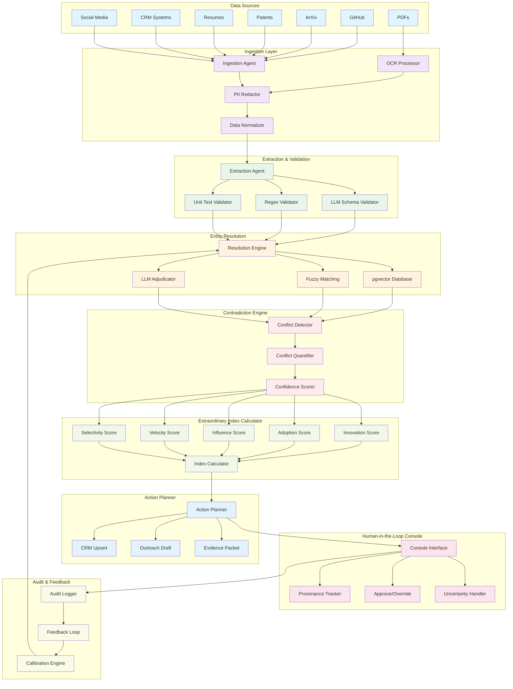

# Talent Resolution Agent (TRA) - Architecture Diagram

## Multi-Agent System Workflow

## Key Components

### 1. **Data Ingestion Layer**
- **Ingestion Agent**: Orchestrates data collection from multiple sources
- **OCR Processor**: Extracts text from PDFs and images
- **PII Redactor**: Removes sensitive information for compliance
- **Data Normalizer**: Standardizes data formats across sources

### 2. **Extraction & Validation**
- **Extraction Agent**: Uses LLMs to extract structured data
- **Schema Validators**: Multiple validation layers (LLM, regex, unit tests)
- **Quality Assurance**: Ensures data integrity before processing

### 3. **Entity Resolution Engine**
- **pgvector Database**: Stores embeddings for similarity matching
- **Fuzzy Matching**: Handles name variations and typos
- **LLM Adjudicator**: Makes final decisions on identity resolution

### 4. **Contradiction Engine**
- **Conflict Detection**: Identifies conflicting information
- **Quantification**: Measures conflict severity
- **Confidence Scoring**: Provides uncertainty metrics

### 5. **Extraordinary Index Calculator**
- **Multi-dimensional Scoring**: Innovation, Adoption, Influence, Velocity, Selectivity
- **Calibrated Metrics**: Objective, comparable talent assessment
- **Weighted Aggregation**: Combines scores into single index

### 6. **Action Planner**
- **CRM Integration**: Updates candidate records
- **Outreach Generation**: Creates personalized messages
- **Evidence Packets**: Compiles supporting documentation

### 7. **Human-in-the-Loop Console**
- **Provenance Tracking**: Complete audit trail
- **Approval Controls**: Human oversight for critical decisions
- **Uncertainty Handling**: Graceful handling of ambiguous cases

### 8. **Audit & Feedback Loop**
- **Continuous Learning**: Improves accuracy over time
- **Calibration**: Adjusts scoring based on outcomes
- **Error Handling**: Robust error recovery and reporting
